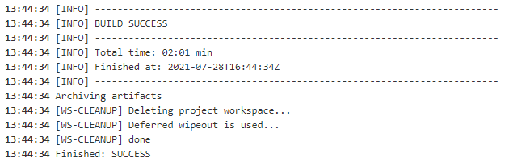

## Maven Build Archive

Looking by the log of 2º Exercise, it's possible to see that some ```.jar``` were generated. Identify this artifacts and store them in the Jenkins Job.
To do this exercise, create a Jenkins Job:
  * Job name must be build_archive_maven_user0[1-9].
  * Must be a copy of build_maven_user0[1-9] with storage feature.
  * Delete the Workspace when the job is finished

The output must be something like:




