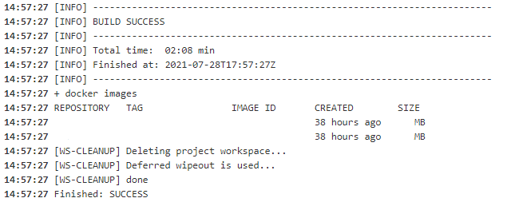

## Maven Build Docker

Acesse o Jenkins na URL fornecida no início deste teste.
* Create a Free-Style Job called build_docker_maven_user0[1-9]
*	Clone the repo you uploaded 1º Exercise
*	Load gitLib.sh as a library 
*	Execute the function to clone [maven-simple](https://github.com/jitpack/maven-simple)
*	In [Docker Hub](https://hub.docker.com/),and choose an image to build the maven project
*	Build the project inside the choosen docker image
*	List all Docker Images
*	Delete the workspace when job is finished

The output must be something like this:

