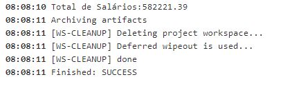
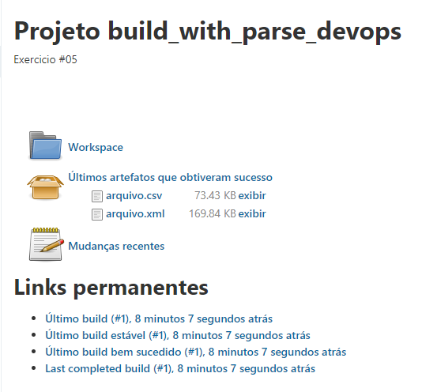

## Shell Script Parse

You must create a job that will parse a ```.xml``` file and return a value from it.
In order to do this task:
  * Create a Free-Style Jenkins Job called shell_parse_user0[1-9].
  * Job mus allow the upload of a XML file.
     * XML file to be used is  [RelatórioDeFolhasDePagamento.xml](./RelatórioDeFolhasDePagamento.xml)
  * Create one shell script must extract information from XML file, and save as a CSV.
  * Create a second shell script that will read the CSV file, and sum all salary, print the output in the console.
  * Store the XML and the CSV in Jenkins Job execution.
  * Delete the Workspace after job execution.
  
The output must be something like this (reference to 2021/June):





